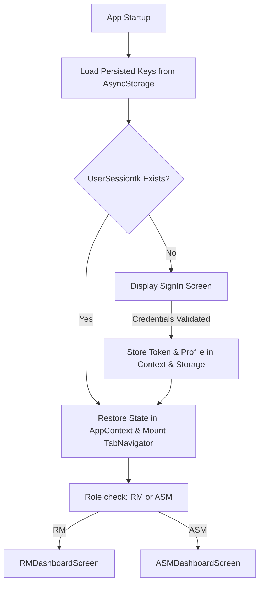

# VMS GATI App — Vehicle Management System & Dispatch Tracker

Welcome to the **VMS GATI App**, a robust mobile application built using **React Native** and **TypeScript**. 

The application is designed for **Relationship Managers (RMs)** and **Area Sales Managers (ASMs)** to manage dealership vendors, track vehicle sales orders, coordinate vehicle dispatch, register payments (including cheques and blank cheques), manage vehicle registration documents (Sales Letters), and track High Security Registration Plate (HSRP) status.

> [!NOTE]  
> This project represents a complete migration of a legacy hybrid app originally built with **Ionic, Angular, and Capacitor** into a modern, native **React Native** application. The migration preserves core business logic, API endpoint structures, and storage keys, while adopting React patterns (Hooks, Context, and Functional Components).

---

## 📋 Table of Contents
1. [Tech Stack](#-tech-stack)
2. [Project Architecture & Directory Structure](#-project-architecture--directory-structure)
3. [Core Modules & Submodules](#-core-modules--submodules)
4. [Screen Directory & Component Mapping](#-screen-directory--component-mapping)
5. [API Integration & Endpoint Reference](#-api-integration--endpoint-reference)
6. [Data Flow & State Management](#-data-flow--state-management)
7. [Environment Configuration & Build Setup](#-environment-configuration--build-setup)
8. [Run & Development Guide](#-run--development-guide)
9. [Migration Notes (Angular/Capacitor vs React Native)](#-migration-notes)

---

## 🛠 Tech Stack

The project uses a modern React Native infrastructure:

| Category | Technology / Package | Purpose |
| :--- | :--- | :--- |
| **Core Framework** | [React Native (v0.82.0)](https://reactnative.dev/) | Cross-platform mobile development |
| **Language** | [TypeScript](https://www.typescriptlang.org/) | Static typing and interface definition |
| **Navigation** | [`@react-navigation/native` (v7.1.18)](https://reactnavigation.org/) <br> `@react-navigation/native-stack` <br> `@react-navigation/bottom-tabs` | Hierarchical and tabbed routing (replacing Angular's RouterModule) |
| **Network Client** | [Axios (v1.18.1)](https://axios-http.com/) | Promise-based HTTP client for API requests |
| **Local Storage** | [`@react-native-async-storage/async-storage` (v2.2.0)](https://github.com/react-native-async-storage/async-storage) | Persistent device storage (replacing `@capacitor/preferences`) |
| **Config Management**| [`react-native-config` (v1.6.1)](https://github.com/zoontek/react-native-config) | Multi-environment base URL configuration |
| **UI Components** | `@react-native-picker/picker` <br> `react-native-safe-area-context` <br> `react-native-gesture-handler` | Core interactive components |
| **Media Handling** | [`react-native-image-picker` (v8.2.1)](https://github.com/react-native-image-picker/react-native-image-picker) | Image acquisition from camera or gallery for uploads |
| **Iconography** | [`react-native-vector-icons/Ionicons` (v10.3.0)](https://github.com/oblador/react-native-vector-icons) | Vector icon packages matching Ionic icons |
| **Testing** | `jest` & `react-test-renderer` | Automated unit testing and component tree validation |

---

## 📂 Project Architecture & Directory Structure

```
VMS_GATI_App/
├── App.tsx                     # App entry point wrapping React Navigation and Providers
├── index.js                    # Metro entry point registering App component
├── app.json                    # Application metadata (name, displayName)
├── babel.config.js             # Babel compilation rules
├── metro.config.js             # Metro packager settings
├── package.json                # Project dependencies and npm scripts
├── tsconfig.json               # TypeScript configuration
├── android/                    # Native Android project configuration
├── ios/                        # Native iOS project configuration
└── src/                        # Main Application Codebase
    ├── assets/                 # Application assets (images, logos, icons)
    │   └── imgs/               # Static image assets for dashboard cards
    ├── context/                # Global State Providers
    │   └── AppContext.tsx      # AppContext (Session, Designation, Vendor, RM state)
    ├── navigation/             # Navigation configurations
    │   ├── AppNavigator.tsx    # Conditional routing stack (Auth checked -> SignIn or MainTabs)
    │   ├── TabNavigator.tsx    # Bottom navigation tabs and nested Stack Navigators
    │   └── types.ts            # TypeScript definitions for stacks and screen parameters
    ├── services/               # API and Storage Services
    │   ├── api.ts              # Axios wrapper and all network endpoint functions
    │   └── storage.ts          # AsyncStorage helper wrapping item/get/remove operations
    ├── utils/                  # Helper utilities and formatters
    │   ├── formatters.ts       # Text formatters (Dates, Status IDs, List Filters)
    │   └── helpers.ts          # Global UI helpers (Alerts, Confirm Dialogs)
    └── screens/                # UI Screen Components (grouped in directories)
        ├── SignIn/             # Login and user verification screen
        ├── RMDashboard/        # RM (Relationship Manager) statistics dashboard
        ├── ASMDashboard/       # ASM (Area Sales Manager) statistics dashboard
        ├── SalesOrderDashboard/# Hub for Sales Orders
        │   ├── TodaySalesOrder/           # Sales orders made today
        │   └── PendingSalesOrder/         # Pending dispatches from last 7 days
        ├── PaymentDashboard/   # Hub for Payments
        │   ├── PendingPayment/            # Pending payments lists
        │   ├── PaymentRecFromVendor/      # Step-based wizard to record payment receipts
        │   └── PaymentRecWithoutAmt/      # Wizard to record blank cheque receipts
        ├── SLDashboard/        # Hub for Sales Letters
        │   ├── PendingSalesLetter/        # Pending SL requests
        │   ├── SLCurrentUpdates/          # In-progress SL tracking
        │   ├── SLRecByRM/                 # Mark physical SL receipt
        │   ├── ServiceBookStatus/         # Service book verification
        │   └── HSRPNumberPending/         # License plate receipt tracking (Number Receive/Hold)
        ├── AttachNewDocs/      # Manage vehicle documents for Sales Letters
        ├── AddDocumentModal/   # Camera/Image picking & classification modal
        └── ... (other utility screens detailed below)
```

---

## 📦 Core Modules & Submodules

The VMS GATI application is partitioned into six core functional modules:

### 1. Authentication & Session Module
*   **Purpose**: Validates employee credentials and persists authorization credentials.
*   **Submodules**:
    *   *Credential Verification*: Input field validation for user name, password, and designation.
    *   *Designation Classification*: Routes dashboard layouts based on the role selected during login (`RM` or `ASM`).
    *   *Session Persistence*: Stores the API session token (`UserSessiontk`) and employee name in local storage, preventing recurring login prompts.

### 2. Role-Based Dashboard Module
*   **Purpose**: Serves as the landing hub, loading real-time operational statistics depending on user credentials.
*   **Submodules**:
    *   *Relationship Manager (RM) Dashboard*: Filters statistical indicators based on a single selected vendor mapped to the logged-in RM.
    *   *Area Sales Manager (ASM) Dashboard*: Dual-filter dashboard that allows filtering metrics by RM name first, and then by the corresponding vendors under that RM.
    *   *Indicator Cards*: Quick navigation shortcuts that dynamically badge the counts of pending items (e.g. pending payments, holding sales letters, etc.) fetched from the API.

### 3. Sales Order Module
*   **Purpose**: Manages and displays vehicle orders submitted by vendors.
*   **Submodules**:
    *   *Today's Sales Orders*: Real-time list of sales orders placed today with details on items, dispatch dates, pricing, and ageing parameters.
    *   *Pending Dispatches*: Tracks purchase orders from Dolphin where vehicles haven't been dispatched in the last 7 days.
    *   *No Sales Order (NSO)*: Lists "NSO Dealers"—vendors who haven't placed an order in the last 3 days—facilitating RM/ASM follow-ups.

### 4. Payment Management Module
*   **Purpose**: Handles physical collection and logging of dealer/customer payments.
*   **Submodules**:
    *   *Pending Payments*: Breakdown of pending collection amounts grouped by company for the selected vendor.
    *   *Payment Recording (With Amount)*: A multi-step wizard to record payment details (Mode, Cheque details, Bank names, branch details, company destinations) against specific vehicles.
    *   *Blank Cheque Recording (Without Amount)*: Specialized workflow for collecting blank cheques from vendors, skipping specific amount distributions but capturing bank details and cheque reference IDs.

### 5. Sales Letter (SL) & Registration Module
*   **Purpose**: Manages vehicle documentation processes, including regional registration and service booklets.
*   **Submodules**:
    *   *SL Approval Statuses*: Tracks SL requests that are Pending, on Hold, In Progress, or ready to be Received.
    *   *Service Book Status*: Logs and marks the physical transition of service booklets to the RM.
    *   *High Security Registration Plate (HSRP)*: Manages pending license plate deliveries. Uses a tabbed interface separating plates ready for receipt from those currently on hold.

### 6. Document Attachment Module
*   **Purpose**: Attaches compliance documents to Sales Letters directly from the mobile interface.
*   **Submodules**:
    *   *Camera / Gallery Integration*: Uses native device image pickers to capture documents.
    *   *Constraint-based Uploads*: Validates upload types based on server-defined lists of mandatory documents (`compulsoryDocIDs`) and maximum bounds (`maxLengthDocIDList`).

---

## 🖥 Screen Directory & Component Mapping

The application contains **20 screens** located in [src/screens](file:///d:/VMS_GATI_App/src/screens). Below is the comprehensive guide mapping screen directories to functionality:

### Auth & Navigation Root
1.  **[SignInScreen](file:///d:/VMS_GATI_App/src/screens/SignIn/SignInScreen.tsx)**
    *   *Role*: Entry-point screen.
    *   *Features*: Selects designation (`RM`/`ASM`), validates username and password, requests server token, and resets navigation stack.
    *   *Component Usage*: `@react-native-picker/picker`, `TextInput`, secure toggle for password visibility.

### Dashboards
2.  **[RMDashboardScreen](file:///d:/VMS_GATI_App/src/screens/RMDashboard/RMDashboardScreen.tsx)**
    *   *Role*: Landing screen for RM designation.
    *   *Features*: Selects a single vendor, fetches dashboard badges from `RMDashboardData` API. Includes a direct shortcut to the "NSO Dealer" list and a "Logout" action.
3.  **[ASMDashboardScreen](file:///d:/VMS_GATI_App/src/screens/ASMDashboard/ASMDashboardScreen.tsx)**
    *   *Role*: Landing screen for ASM designation.
    *   *Features*: Features two dropdown filters (RM list + filtered Vendor list). Renders dashboard badges based on combined RM + Vendor metrics.

### Sales Orders
4.  **[SalesOrderDashboardScreen](file:///d:/VMS_GATI_App/src/screens/SalesOrderDashboard/SalesOrderDashboardScreen.tsx)**
    *   *Role*: Grid navigation hub for the Sales Order module.
    *   *Features*: Displays three navigation cards: Last 7 Days Pending, Today's Orders, and No Sales Order.
5.  **[TodaySalesOrderScreen](file:///d:/VMS_GATI_App/src/screens/TodaySalesOrder/TodaySalesOrderScreen.tsx)**
    *   *Role*: Lists today's new sales orders.
    *   *Features*: Displays order items, product descriptions, colors, total price, age of order, and dispatch dates.
6.  **[PendingSalesOrderScreen](file:///d:/VMS_GATI_App/src/screens/PendingSalesOrder/PendingSalesOrderScreen.tsx)**
    *   *Role*: Lists pending vehicle dispatches.
    *   *Features*: Details vehicles that have been ordered but are awaiting physical dispatch from the warehouse.
7.  **[VendorsWithoutSalesOrderScreen](file:///d:/VMS_GATI_App/src/screens/VendorsWithoutSalesOrder/VendorsWithoutSalesOrderScreen.tsx)**
    *   *Role*: Lists inactive vendors.
    *   *Features*: Flags dealers with no orders for 3+ consecutive days. (Reused for NSO options under both Sales Order and Dashboard tabs).

### Payments
8.  **[PaymentDashboardScreen](file:///d:/VMS_GATI_App/src/screens/PaymentDashboard/PaymentDashboardScreen.tsx)**
    *   *Role*: Grid navigation hub for the Payment module.
    *   *Features*: Displays cards linking to Pending Payment list, Receive Payment flow, and Receive Blank Cheque flow.
9.  **[PendingPaymentScreen](file:///d:/VMS_GATI_App/src/screens/PendingPayment/PendingPaymentScreen.tsx)**
    *   *Role*: Visualizes due payments.
    *   *Features*: Displays company-wise pending amounts for a selected vendor.
10. **[PendingPaymentFiveDaysOldScreen](file:///d:/VMS_GATI_App/src/screens/PendingPaymentFiveDaysOld/PendingPaymentFiveDaysOldScreen.tsx)**
    *   *Role*: Highlights high-priority outstanding dues.
    *   *Features*: Lists accounts with unpaid outstanding invoices older than 5 days.
11. **[PaymentRecFromVendorScreen](file:///d:/VMS_GATI_App/src/screens/PaymentRecFromVendor/PaymentRecFromVendorScreen.tsx)**
    *   *Role*: Wizard-based workflow to record incoming payments.
    *   *Features*: 
        *   **Step 0**: Displays and selects vendor-associated companies with pending amounts.
        *   **Step 1**: Lists vehicles / E-payments with checkbox selectors and text inputs to adjust payment allocations.
        *   **Step 2**: Payment parameters form (Mode: Cash/Cheque/Online; Bank, branch name, account number, cheque date, and hypothecation details). Fetches bank detail validation from API.
        *   **Step 3**: Re-validates details, previews summary data, and posts to the API.
12. **[PaymentRecWithoutAmtScreen](file:///d:/VMS_GATI_App/src/screens/PaymentRecWithoutAmt/PaymentRecWithoutAmtScreen.tsx)**
    *   *Role*: Wizard-based workflow to log blank cheques.
    *   *Features*: Similar structure to the standard receipt flow but omits vehicle/amount allocation screens. Logs bank metadata, cheque references, and marks direct authorization options.

### Sales Letters & Deliverables
13. **[SLDashboardScreen](file:///d:/VMS_GATI_App/src/screens/SLDashboard/SLDashboardScreen.tsx)**
    *   *Role*: Grid navigation hub for Sales Letters and registration components.
    *   *Features*: Navigation cards for Pending SLs, SL Updates, Receive SL, Service Book, and HSRP.
14. **[PendingSalesLetterScreen](file:///d:/VMS_GATI_App/src/screens/PendingSalesLetter/PendingSalesLetterScreen.tsx)**
    *   *Role*: Approvals dashboard.
    *   *Features*: Lists registration or Sales Letter approval requests awaiting action.
15. **[SLCurrentUpdatesScreen](file:///d:/VMS_GATI_App/src/screens/SLCurrentUpdates/SLCurrentUpdatesScreen.tsx)**
    *   *Role*: Documents tracking list.
    *   *Features*: Displays Sales Letter processing logs. Offers a navigation button to attach new files to selected entries.
16. **[SLRecByRMScreen](file:///d:/VMS_GATI_App/src/screens/SLRecByRM/SLRecByRMScreen.tsx)**
    *   *Role*: Logs document arrivals.
    *   *Features*: Displays sales letters and allows the user to post a receipt notice marking physical possession by the RM.
17. **[ServiceBookStatusScreen](file:///d:/VMS_GATI_App/src/screens/ServiceBookStatus/ServiceBookStatusScreen.tsx)**
    *   *Role*: Logs warranty booklet arrivals.
    *   *Features*: Displays service books status and provides a button to mark physical booklets as received by the RM.
18. **[HSRPNumberPendingScreen](file:///d:/VMS_GATI_App/src/screens/HSRPNumberPending/HSRPNumberPendingScreen.tsx)**
    *   *Role*: Tracks physical license plate delivery.
    *   *Features*: Dual tabs: **Number Receive** (lists plates waiting to be marked as received) and **Hold** (lists plates put on hold by Dolphin/Authorities). Includes search filter by chassis or plate.

### Document Upload helpers
19. **[AttachNewDocsScreen](file:///d:/VMS_GATI_App/src/screens/AttachNewDocs/AttachNewDocsScreen.tsx)**
    *   *Role*: Form mapping for document submissions.
    *   *Features*: Displays previously uploaded documents (prefixed with `API_IP`). Triggers the document upload modal and saves attachments with remarks to `SaveAdditionalSLDocs` API.
20. **[AddDocumentModalScreen](file:///d:/VMS_GATI_App/src/screens/AddDocumentModal/AddDocumentModalScreen.tsx)**
    *   *Role*: Native camera wrapper modal.
    *   *Features*: Prompts user to select proof category and subtype. Triggers `react-native-image-picker` to capture or select images, converts them to base64, and returns the metadata to `AttachNewDocsScreen`.

---

## 🔌 API Integration & Endpoint Reference

All network integrations are declared in [api.ts](file:///d:/VMS_GATI_App/src/services/api.ts). The client uses `axios` and points to a base URL loaded from environment parameters (`react-native-config`).

### API Headers
Every authenticated API request appends the following headers:
```typescript
const authHeaders = (sessionToken: string) => ({
    'Content-Type': 'application/json',
    SessionToken: sessionToken,
    AppVersion: '1.0.18',
});
```

### Endpoints Table

| Category | Function Name | Method | Path | Description |
| :--- | :--- | :--- | :--- | :--- |
| **Auth** | `LogIn` | POST | `MobileLogin/LoginEmployees` | Logs employee in with credentials & designation |
| **Auth** | `LogoutEmployee` | POST | `MobileLogin/LogoutEmployee` | Invalidates active session |
| **Filters**| `GetVendorListOfRM` | GET | `Other/GetListOfVendorBasedOnRM` | Fetches vendors mapped to active RM |
| **Filters**| `GetListOfRMAndVendorsBasedOnASM` | GET | `Other/GetListOfRMAndVendorsBasedOnASM` | Fetches ASM's child RMs and mapped vendors |
| **Dashboard**| `RMDashboardData` | GET | `Other/RMDashboardData?VendorID={id}` | Fetches RM badge statistics |
| **Dashboard**| `ASMDashboardData` | GET | `Other/ASMDashboardData?VendorID={vid}&RMID={rmid}` | Fetches ASM badge statistics |
| **Sales** | `TodaysSalesorderForRM` | GET | `MobileGoodown/TodaysSalesOrderForRM` | Lists orders placed today |
| **Sales** | `LastFewDaysPending_GoodsDispatchForRM` | GET | `MobileGoodown/LastFewDaysPending_GoodsDispatchForRM` | Lists pending vehicle dispatches |
| **Sales** | `VendorWithoutSalesOrderForRM` | GET | `MobileGoodown/VendorWithoutSalesOrderForRM` | Lists vendors inactive for 3+ days |
| **Payment**| `PaymenofVendorForRM` | GET | `MobilePayment/getPaymenofVendorForRM` | Fetches details of pending payments |
| **Payment**| `getPaymentPendingMorethan5daysofVendorForRM`| GET | `MobilePayment/getPaymentPendingMorethan5daysofVendorForRM` | Fetches overdue payments (5+ days) |
| **Payment**| `GetPendingPaymentOfVendorCompanyWiseAndDropdownListData` | GET | `MobilePayment/GetPendingPaymentOfVendorCompanyWise...` | Companies with outstanding dues + payment form options |
| **Payment**| `ReceivedPaymentFromVendor` | POST | `MobilePayment/ReceivedPaymentFromVendor` | Submits payment receipt details |
| **Payment**| `GetBankDetails` | GET | `MobilePayment/GetBankDetails` | Fetches validation limits for selected bank account |
| **Payment**| `GetOnlyPendingEPayment_OfVendorCompanyWiseAndDropdownListData` | GET | `MobilePayment/GetOnlyPendingEPayment_OfVendorCompanyWise...` | Fetches companies with pending E-payments |
| **Payment**| `CheckPurchaseVendorFromSalesOrderDetID` | POST | `MobilePayment/CheckPurchaseVendorFromSalesOrderDetID` | Validates chosen purchase order |
| **Payment**| `GetReceivedPaymentWithoutAmountFromVendor` | POST | `MobilePayment/ReceivedPaymentWithoutAmountFromVendor` | Submits blank cheque receipt details |
| **Payment**| `SavePaymentRemarkInSalesOrderDet` | POST | `MobilePayment/SavePaymentRemarkInSalesOrderDet` | Saves custom tracking remark on order |
| **Payment**| `IsChequOrPaymentNumberAvail` | GET | `MobilePayment/IsChequOrPaymentNumberAvail` | Deduplicates cheque references |
| **SL** | `GetPendingSalesLetterRequestForRM` | GET | `MobileSalesLetter/GetPendingSalesLetterRequestForRM` | Pending Sales Letter requests |
| **SL** | `GetCurrentSLRequestedForRM` | GET | `MobileSalesLetter/GetCurrentSLRequestedForRM` | Current Sales Letter log requests |
| **SL** | `GetCurrentSLHoldForRM` | GET | `MobileSalesLetter/GetCurrentSLHoldForRM` | Sales letters currently on hold |
| **SL** | `GetCurrentSLInProgressForRM` | GET | `MobileSalesLetter/GetCurrentSLInProgressForRM` | Sales letters currently in progress |
| **SL** | `GetSLRecByRM_SalesLetterForRM` | GET | `MobileSalesLetter/GetSLRecByRM_SalesLetterForRM` | Sales letters ready to be marked as received |
| **SL** | `SLRecievedByRMForRM` | POST | `MobileSalesLetter/SLRecievedByRMForRM` | Marks sales letter received by RM |
| **Warranty**| `GetListofServiceBookStatusForRM` | GET | `MobileSalesLetter/GetListofServiceBookStatusForRM` | Service books delivery status |
| **Warranty**| `ServiceBookRecByRMForRM` | POST | `MobileSalesLetter/ServiceBookRecByRMForRM` | Marks service book received by RM |
| **HSRP** | `HSRPNumberReceivePendingByRM_ASM` | GET | `MobileHSRP/HSRPNumberReceivePendingByRM_ASM` | Pending HSRP plates list |
| **HSRP** | `HSRPNumberHoldByDolphinOrAuthForRM_ASM_App` | GET | `MobileHSRP/HSRPNumberHoldByDolphinOrAuthForRM_ASM_App` | Hold HSRP plates list |
| **HSRP** | `HSRPNumberReceivedByRM_ASM` | POST | `MobileHSRP/HSRPNumberReceivedByRM_ASM` | Marks HSRP plate received |
| **Docs** | `GetMobileDropDownList` | GET | `Other/GetMobileList?Typeof={type}` | Options for document types/subtypes |
| **Docs** | `GetListOfDocsBySLID` | GET | `MobileSalesLetter/GetDocumentFromIDForRM?SalesLetterID={id}` | Fetches previously attached docs for an SL |
| **Docs** | `GetValidationForDocs` | GET | `MobileSalesLetter/GetValidationForDocs` | Mandatory upload category list and counts |
| **Docs** | `SaveAdditionalSLDocs` | POST | `MobileSalesLetter/SaveSLDocsForRM` | Uploads base64 document attachments |

---

## 🔄 Data Flow & State Management

The app uses **React Context** combined with custom utility helper services to distribute and manage application state:

### Global Context (`AppContext`)
Declared in [AppContext.tsx](file:///d:/VMS_GATI_App/src/context/AppContext.tsx), this provider wraps the root component structure. It handles loading and synchronizing runtime state variables, automatically saving updates to `AsyncStorage`:

*   **`sessionToken`**: Active authorization string passed into Axios request headers.
*   **`designation`**: Dictates the dashboard interface. Value matches `'RM'` or `'ASM'`.
*   **`employeeName`**: Logged-in username displayed in the welcome headers.
*   **`selectedVendorId` / `selectedVendorName`**: Remembers the active vendor chosen on the dashboard, so sub-screens can query detail endpoints without passing route parameters back and forth.
*   **`selectedRMId` / `selectedRMName`**: Mapped ASM filters, defining the scope of sub-screen data fetches.



### Navigation Parameter Flow
For transient parameters, the application relies on route parameters:
*   **`AttachNewDocsScreen`** redirects to **`AddDocumentModalScreen`** passing required document limits.
*   Upon image capture, **`AddDocumentModalScreen`** triggers `navigation.navigate('AttachNewDocs', { newDoc: documentObject })`.
*   A listener hook inside **`AttachNewDocsScreen`** intercepts the parameter, adds the image object to its upload queue, and resets the navigation parameter to clean up the stack.

---

## ⚙ Environment Configuration & Build Setup

The base path and app version header are defined in [`.env`](file:///d:/VMS_GATI_App/.env) at the project root:
```properties
API_URL=http://122.185.131.170:224/api/
APP_VERSION=1.0.18
```
The application loads this config at runtime using `react-native-config` (`import Config from 'react-native-config';`).

For UAT/Live parity, keep separate env files (for example, `.env.uat` and `.env.live`) and set `APP_VERSION` per environment to match backend minimum version policy.

### Native Prerequisites
1.  **Node.js**: Version `>=20`
2.  **JDK**: Version `17` (Recommended for React Native 0.82)
3.  **Android Studio**: Android SDK, Command-line tools, and an Emulator configured with Android 13 (API 33).
4.  **Xcode** (macOS only): For building the iOS version.
5.  **CocoaPods**: Required to build iOS native modules.

---

## 🏃 Run & Development Guide

Follow these steps to set up and run the application locally:

### 1. Initial Setup & Dependencies
Clone the repository and install npm packages:
```sh
npm install
```

### 2. Configure Native iOS Dependencies (macOS Only)
If developing on macOS for iOS, install the bundler gems and run CocoaPods install:
```sh
# Install ruby bundler tools
bundle install

# Install pods
bundle exec pod install
```

### 3. Start Metro Dev Server
Run the Metro bundler to compile Javascript assets:
```sh
npm start
```

### 4. Build and Launch Emulator
With Metro running, open a new command terminal and launch on Android or iOS:

#### Run Android Emulator:
```sh
npm run android
```

#### Run iOS Simulator:
```sh
npm run ios
```

### 5. Code Quality & Testing Commands
*   **Linting checks**: `npm run lint` (runs ESLint checks on screens, services, and utilities)
*   **Run Jest unit tests**: `npm run test`

---

## 🔌 Migration Notes
This project was migrated from a legacy hybrid layout. The following rules were applied during migration:

1.  **Angular RxJS Pipes** $\rightarrow$ **Plain JS formatters**: 
    The original app used Angular pipe filters (e.g., `dateTimeSplit`). In React Native, these are rewritten as pure functional utilities in [formatters.ts](file:///d:/VMS_GATI_App/src/utils/formatters.ts) and called directly during JSX mapping.
2.  **Ionic UI Components** $\rightarrow$ **Native React Native Views**:
    *   `<ion-select>` and `<ion-select-option>` are replaced by `@react-native-picker/picker`.
    *   `<ion-input>` is replaced by `<TextInput>`.
    *   `<ion-button>` is replaced by `<TouchableOpacity>`.
    *   Custom layout items utilize Flexbox styled within native `StyleSheet` modules.
3.  **Capacitor Preferences** $\rightarrow$ **AsyncStorage**:
    The native backend uses `@react-native-async-storage/async-storage` using the exact keys used in the hybrid application (`UserSessiontk`, `DesingationName`, `SelectedVendorID`, etc.), ensuring seamless session continuation for migrated users.
4.  **Swiper JS (Angular Wizard)** $\rightarrow$ **Step States**:
    The complex wizards (`PaymentRecFromVendorScreen`) manage state step boundaries internally using a standard `step` state counter `[0, 1, 2, 3]` and render components conditionally, avoiding heavy external carousel dependencies.
